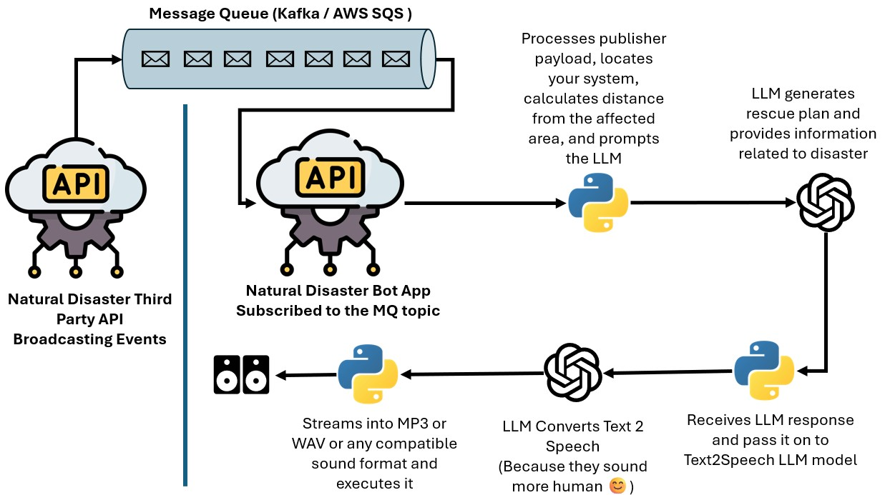

# Disaster Relief Information Bot

The Disaster Relief Information Bot is a Python-based application designed to provide timely updates and alerts during natural disasters. With a focus on accessibility and real-time processing, this bot can be used by individuals, communities, and organizations to enhance preparedness and response.

## Features
- **Real-Time Disaster Updates**: Receives event information (e.g., floods, earthquakes, wildfires) and processes it in real time.
- **Proximity-Based Alerts**: Notifies users only if a disaster is within a specified distance from their location.
- **Audio Playback**: Delivers alerts using audio messages, ensuring accessibility for all users.
- **Modular Design**: Consists of a publisher-subscriber model for flexibility and scalability.

## Architecture Overview
1. **Publisher**: Accepts disaster event data, determines the event's geolocation, and saves the data for processing.
2. **Subscriber**: Consumes the event data, evaluates its relevance based on the user's location, and delivers audio alerts.

### Workflow
1. **Input**: Event data including the type, location (city, state, country), and event details.
2. **Processing**:
   - Publisher serializes and stores the event data.
   - Subscriber reads the data, checks proximity, and generates audio alerts.
3. **Output**: Audio alerts for nearby disasters, ensuring immediate awareness.

### Flowchart
Below is the flowchart summarizing the app's workflow:



## Installation

### Prerequisites
- Python 3.11.11
- Conda package manager

### Required Packages
Install the necessary dependencies using the `environment.yaml` file:
```bash
conda env create -f environment.yaml
conda activate disaster-bot-env
```

### Additional Setup
- Create a `.env` file in the root directory to store your OpenAI API key:
  ```
  OPENAI_API_KEY=your_openai_api_key
  ```

## Running the Application

### Starting the Publisher
Run the publisher to accept disaster event data:
```bash
python natural_disaster_publisher.py
```

### Starting the Subscriber
Run the subscriber to process and play alerts:
```bash
python natural_disaster_subscriber.py
```

## Usage

### Publishing an Event
Use the `/publish` endpoint to send event data to the publisher:
```bash
curl -X POST http://localhost:5001/publish -H "Content-Type: application/json" -d '{
  "city": "Ottawa",
  "state": "Ontario",
  "country": "Canada",
  "event_type": "FL"
}'
```

### Starting the Consumer
Start the subscriber's consumer thread to process and respond to events:
```bash
curl http://localhost:5002/start-consumer
```

## Directory Structure
```
.
├── app/
│   ├── natural_disaster_publisher.py          # Handles event publishing
│   ├── natural_disaster_subscriber.py         # Handles event consumption and alerts
├── data/                                      # Stores serialized event data
├── audio/                                     # Stores generated audio alerts
├── environment.yaml                           # Conda environment dependencies
├── .env                                       # API key configuration
├── images/                                    # Contains flowchart and other visuals
│   └── flowchart.jpg                          # Workflow flowchart
└── README.md                                  # Project documentation
```

## How It Can Be Used
- **Emergency Response Teams**: Provide immediate alerts and updates for decision-making.
- **Mobile Applications**: Integrate the bot for real-time disaster notifications.
- **Community Centers**: Use audio alerts to inform people without relying on screens.
- **NGOs and Governments**: Enhance disaster preparedness and response workflows.

## Contributing
Contributions are welcome! Feel free to submit a pull request or open an issue to suggest improvements.

## License
This project is open-source and available under the MIT License.

---

Feel free to explore, adapt, and use this bot to build solutions that make a positive impact. For more details, refer to the [GitHub repository](#) (add your repo link).
